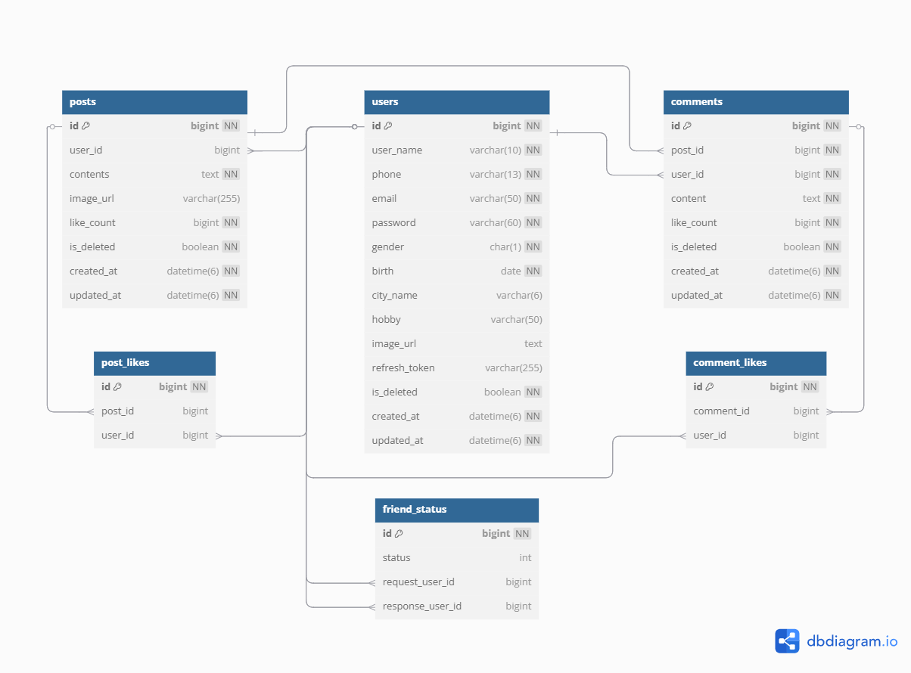

# FakeBookProject
소셜 네트워크 서비스(SNS)와 유사한 백엔드 서버로, 사용자가 자신의 프로필을 관리하고 친구 관계를 맺거나 게시글과 댓글을 작성하고, 좋아요를 주고받을 수 있는 기능을 제공합니다.
또한, 인증 및 인가는 JWT 토큰을 사용하여 구현되었습니다. 사용자는 로그인 후 발급받은 JWT 토큰을 통해 각종 요청을 인증하고, 토큰을 통해 접근을 제어할 수 있습니다.

#### 개발 기간
2025.04.07 - 2025.04.12

#### 기술 스택
   
     
  
   


<br>

## ERD 다이어그램


<br>

## 패키지 구조
```
com.example.fakebookproject  
├── 📁 api  
│   ├── 📁 auth  
│   │   ├── 📁 controller  
│   │   ├── 📁 service  
│   │   └── 📁 dto  
│   ├── 📁 comment  
│   │   ├── 📁 controller  
│   │   ├── 📁 dto  
│   │   ├── 📁 entity  
│   │   ├── 📁 service  
│   │   └── 📁 repository  
│   ├── 📁 friend  
│   │   ├── 📁 controller  
│   │   ├── 📁 dto  
│   │   ├── 📁 entity  
│   │   ├── 📁 service  
│   │   └── 📁 repository  
│   ├── 📁 like  
│   │   ├── 📁 controller  
│   │   ├── 📁 dto  
│   │   ├── 📁 entity  
│   │   ├── 📁 service  
│   │   └── 📁 repository  
│   ├── 📁 post  
│   │   ├── 📁 controller  
│   │   ├── 📁 dto  
│   │   ├── 📁 entity  
│   │   ├── 📁 service  
│   │   └── 📁 repository  
│   └── 📁 user  
│       ├── 📁 controller  
│       ├── 📁 dto  
│       ├── 📁 entity  
│       ├── 📁 service  
│       └── 📁 repository  
├── 📁 common  
│   ├── 📁 auth  
│   ├── 📁 config  
│   ├── 📁 dto  
│   ├── 📁 exception  
│   └── 📁 filter
```

<br>

## 팀원별 주요 담당 기능
- **박신영 (팀장)**
  - **좋아요 기능**: 게시글 및 댓글 좋아요 등록/취소, 좋아요 수 조회
  - **버전 관리 및 협업**: Git 브랜치 전략 및 커밋 관리 담당
- **김태익**
  - **회원 관리**: 회원가입, 정보 수정, 탈퇴, 회원 조회
  - **인증 및 인가**: 로그인, 로그아웃, JWT, 필터 기반 인증 처리
- **최예림**
  - **친구 기능**: 친구 요청/수락/거절 처리, 친구 목록 및 추천 친구 조회
  - **소셜 관계 관리 로직 설계**
- **박기범**
  - **게시글 기능**: 게시글 등록, 수정, 삭제, 페이징 기반 조회
  - **예외 처리 전략**: 사용자 정의 예외 코드 관리
- **홍이랑**
  - **댓글 기능**: 댓글 등록, 수정, 삭제, 페이징 기반 조회
  - **예외 처리 구현**: 전역 예외 처리 및 커스텀 예외 대응

<br>

## 기능 명세서

### 1. 회원 기능

#### 1.1. 회원가입
- 필수 값을 입력해 새로운 사용자를 등록할 수 있다.
- 비밀번호는 암호화되어 저장된다.
- `createdAt`, `updatedAt`은 자동 기록된다.
- ID는 자동 생성된다.
- 입력값 검증에 실패 시 400 에러코드와 에러 메시지가 반환된다.
- **입력값:**
  - `email` : 필수, 이메일 형식, 중복 불가
  - `password` : 필수, 8자 이상, 영문/숫자/특수문자 포함
  - `userName` : 필수, 문자열, 최대 10자
  - `birth` : 필수 `yyyyMMdd` 형식 (예: 19990111)
  - `gender` : 필수, `M` 또는 `F` (Check 제약 조건)
  - `phone` : 필수, 하이픈(-) 포함 13자리 문자열 (예: 010-1234-5678)

#### 1.2. 회원 정보 조회
- User 테이블의 키 값을 이용해 사용자의 정보를 조회할 수 있다.
- 존재하지 않는 사용자 조회 시 404 상태코드와 에러 메시지가 반환된다.
- **입력값:**
  - `userId` : User 테이블의 primary key

#### 1.3. 내 정보 조회
- 현재 로그인한 사용자의 정보를 조회할 수 있다.
- 토큰 기반 인증이 필요하다.

#### 1.4. 사용자 정보 수정
- 로그인한 사용자는 본인의 정보를 수정할 수 있다.
- 변경 전 비밀번호 검증 절차를 진행한다.
- 비밀번호 검증 실패 시 400 상태코드와 에러 메시지가 반환된다.
- **입력값:**
  - `password` : 필수, 8자 이상, 영문/숫자/특수문자 포함
  - `userName` : 문자열, 최대 10자
  - `birth` : `yyyyMMdd` 형식 (예: 19990111)
  - `phone` : 하이픈(-) 포함한 13자리 문자열 (예: 010-1234-5678)
  - `imageUrl` : 문자열
  - `hobby` : 문자열, 최대 50자
  - `cityName` : 문자열
    - Check 제약 조건: 서울, 인천, 대전, 대구, 부산, 광주, 경기, 강원, 충청, 전라, 경상, 제주

#### 1.5. 비밀번호 변경
- 로그인한 사용자는 본인의 비밀번호를 변경할 수 있다.
- 변경 전 기존 비밀번호 검증 절차를 진행한다.
- 새 비밀번호는 암호화되어 저장된다.
- 비밀번호 검증 실패 시 400 상태코드와 에러 메시지가 반환된다.
- **입력값:**
  - `oldPassword` : 기존 비밀번호
  - `newPassword` : 새 비밀번호, 8자 이상, 영문/숫자/특수문자 포함

#### 1.6. 회원 탈퇴
- 로그인한 사용자는 본인의 계정을 삭제(Soft Delete) 할 수 있다.
- 탈퇴 전 비밀번호 검증 절차를 진행한다.
- 삭제 완료 후 자동 로그아웃 처리된다.
- **입력값:**
  - `password` : 필수, 8자 이상, 영문/숫자/특수문자 포함

#### 1.7.1. 로그인
- 이메일과 비밀번호로 로그인을 수행하며, 성공 시 토큰이 발급된다.
- 로그인 실패 시 401 상태코드와 에러 메시지가 반환된다.
- **입력값:**
  - `email` : 필수, 이메일 형식
  - `password` : 필수, 8자 이상, 영문/숫자/특수문자 포함

#### 1.7.2. 로그아웃
- 현재 로그인한 사용자의 토큰을 블랙리스트 처리하고 로그아웃한다.

#### 1.7.3. 토큰 재발급
- 리프레시 토큰을 이용해 만료 시간이 지난 액세스 토큰을 재발급한다.

<br>

### 2. 친구 기능

#### 2.1. 친구 요청

- 로그인한 사용자가 상대방에게 친구 요청을 할 수 있다.
- 로그인한 사용자가 요청자가 된다.
- 상대방이 응답자가 된다.
- 친구 상태가 요청 상태로 기록된다.
- ID는 자동 생성된다.
- **입력값 :**
  - `responseUserId`: 상대방 ID (Long)

#### 2.2. 친구 수락

- 로그인한 사용자가 친구 요청을 수락할 수 있다.
- 로그인한 사용자가 응답자가 된다.
- 상대방이 요청자가 된다.
- 친구 상태가 수락 상태로 변경된다.
- **입력값 :**
  - `responseUserId`: 상대방 ID (Long)

#### 2.3. 친구 거절

- 로그인한 사용자가 친구 요청을 거절할 수 있다.
- 로그인한 사용자가 응답자가 된다.
- 상대방이 요청자가 된다.
- 친구 요청이 삭제된다.
- **입력값 :**
  - `responseUserId`: 상대방 ID (Long)

#### 2.4. 내 친구 목록 조회

- 로그인한 사용자가 본인의 친구 목록을 조회할 수 있다.
- 로그인한 사용자가 요청자 혹은 응답자가 될 수 있다.
- 친구 상태가 수락이 되어있는 상태이다.

#### 2.5. 내가 요청한 친구 목록 조회

- 로그인한 사용자가 요청한 친구 목록을 조회할 수 있다.
- 로그인한 사용자가 요청자가 된다.
- 친구 상태가 요청이 되어있는 상태이다.

#### 2.6. 내가 요청 받은 친구 목록 조회

- 로그인한 사용자가 요청 받은 친구 목록을 조회할 수 있다.
- 로그인한 사용자가 응답자가 된다.
- 친구 상태가 요청이 되어있는 상태이다.

#### 2.7. 추천 친구 목록 조회

- 로그인한 사용자가 추천 친구 목록을 조회할 수 있다.
- 로그인한 사용자와 친구가 아닌 친구 목록을 불러온다.
- 로그인한 사용자와 지역 혹은 취미가 같은 친구 목록을 불러온다.

<br>

### 3. 게시글 기능

#### 3.1. 게시글 등록
- 로그인된 사용자가 게시글을 새로 등록할 수 있다.
- 작성자 ID는 자동으로 연동된다.
- `createdAt`, `updatedAt`은 자동으로 기록된다.
- **입력값:**
  - `content`: 등록할 게시글 내용
  - `imageUrl`: 이미지 주소

#### 3.2.1. 내 게시글 조회
- 로그인 한 유저의 게시글을 확인할 수 있다.
- `updatedAt` 혹은 좋아요 개수 기준 내림차순 정렬
- **조회 조건:**
  - `page`, `size` (기본값 0, 10)

#### 3.2.2. 특정 아이디 게시글 조회
- 특정 아이디 유저의 게시글을 확인할 수 있다.
- `updatedAt` 혹은 좋아요 개수 기준 내림차순 정렬
- **조회 조건:**
  - `page`, `size` (기본값 0, 10)

#### 3.2.3. 메인 페이지 게시글 조회
- 로그인 한 유저와 유저의 친구들의 게시글을 확인할 수 있다.
- `updatedAt` 혹은 좋아요 개수 기준 내림차순 정렬
- **조회 조건:**
  - `page`, `size` (기본값 0, 10)

#### 3.2.4. 특정 게시글 조회
- 특정 게시글을 확인할 수 있다.
- **조회 조건:**
  - `postId`: 조회할 게시글 식별자

#### 3.3. 게시글 수정
- 로그인된 사용자가 본인이 작성한 게시글을 수정할 수 있다.
- 본인의 게시글이 아니면 수정 불가
- **입력값:**
  - `content`: 수정할 게시글 내용
  - `imageUrl`: 수정할 이미지 주소

#### 3.4. 게시글 삭제
- 로그인된 사용자가 본인이 작성할 게시글을 삭제할 수 있다.
- 본인의 게시글이 아니면 삭제 불가
- **입력값:**
  - `postId`: 삭제할 게시글 식별자

<br>

### 4. 댓글 기능

#### 4.1. 댓글 등록
- 로그인된 사용자가 특정 게시글에 댓글을 등록할 수 있다.
- 작성자 ID 및 게시글 ID는 자동으로 연동된다.
- `createdAt`, `updatedAt`은 자동으로 기록된다.
- **입력값:**
  - `content`: 등록할 댓글 내용 (필수, 최대 1000자)

#### 4.2. 댓글 목록 조회
- 특정 게시글에 달린 댓글 목록을 페이지 단위로 조회할 수 있다.
- `createdAt` 기준 내림차순 정렬
- **조회 조건:**
  - `postId`: 조회할 댓글 목록의 게시글 식별자
  - `page`, `size` (기본값 0, 10)

#### 4.3. 댓글 수정
- 로그인된 사용자가 본인이 작성한 댓글을 수정할 수 있다.
- 로그인된 사용자가 본인이 작성한 게시글에 등록된 댓글을 수정할 수 있다.
- 본인의 게시글이 아니거나, 본인이 작성한 댓글이 아니면 수정 불가
- **입력값:**
  - `postId`: 수정할 댓글이 등록된 게시글 식별자
  - `commentId`: 수정할 댓글의 식별자
  - `content`: 수정할 댓글 내용 (최대 1000자)

#### 4.4. 댓글 삭제
- 로그인된 사용자가 본인이 작성할 댓글을 삭제할 수 있다.
- 로그인된 사용자가 본인이 작성한 게시글에 등록된 댓글을 삭제할 수 있다.
- 본인의 게시글이 아니거나, 본인이 작성한 댓글이 아니면 삭제 불가
- **입력값:**
  - `postId`: 삭제할 댓글이 등록된 게시글 식별자
  - `commentId`: 삭제할 댓글의 식별자

<br>

### 5. 게시글 좋아요

#### 5.1 게시글 좋아요 추가
- 로그인된 사용자는 다른 사람의 게시글에 좋아요를 누를 수 있다.
- 로그인한 사용자는 본인의 게시글에는 좋아요를 누를 수 없다.
- 이미 좋아요를 누른 게시글에 다시 누를 수 없다.
- 좋아요가 추가되면 게시글의 좋아요 수가 1 증가한다.
- ID는 자동 생성된다.
- **입력값:**
  - `postId`: 게시글 ID
  - `loginUserId`: 현재 로그인한 사용자 ID

#### 5.2 게시글 좋아요 전체 조회
- 특정 게시글에 좋아요를 누른 사용자 목록을 조회할 수 있다.
- 사용자 이름과 프로필 이미지 URL이 함께 반환된다.
- **입력값:**
  -  `postId`: 게시글 ID
- 출력값:
  - 사용자 정보 리스트 (이름, 이미지 URL)

#### 5.3 게시글 좋아요 취소
- 로그인된 사용자가 이전에 좋아요를 누른 게시글에 대해 좋아요를 취소할 수 있다.
- 좋아요가 삭제되면 게시글의 좋아요 수가 1 감소한다.
- **입력값:**
  - `postId`: 게시글 ID
  - `loginUserId`: 현재 로그인한 사용자 ID

<br>

### 6. 댓글 좋아요

#### 6.1. 댓글 좋아요 추가
- 특정 댓글에 로그인한 사용자가 좋아요를 누를 수 있다.
- 로그인한 사용자의 본인 댓글에는 좋아요를 누를 수 없으며, 이미 좋아요를 누른 경우 중복 추가는 불가하다.
- 좋아요가 추가되면 해당 댓글의 좋아요 수가 1 증가한다.
- ID는 자동 생성된다.
- **입력값:**
  - `postId`: 게시글 ID (Long)
  - `commentId`: 댓글 ID (Long)
  - `loginUserId`: 로그인된 사용자 ID (Long)

#### 6.2. 댓글 좋아요 조회
- 특정 댓글에 좋아요를 누른 사용자들의 목록을 조회할 수 있다.
- 조회 결과에는 사용자 이름과 프로필 이미지 URL이 포함된다.
- **입력값:**
  - `postId`: 게시글 ID (Long)
  - `commentId`: 댓글 ID (Long)
  - `loginUserId`: 로그인된 사용자 ID (Long)
- **출력값:**
    - 사용 자 이름, 이미지 URL 목록 (List)

#### 6.3. 댓글 좋아요 삭제
- 로그인된 사용자가 누른 댓글 좋아요를 취소할 수 있다.
- 삭제 시 해당 댓글의 좋아요 수가 1 감소한다.
- **입력값:**
  - `postId`: 게시글 ID (Long)
  - `commentId`: 댓글 ID (Long)
  - `loginUserId`: 로그인된 사용자 ID (Long)

<br>

## ▶&nbsp;&nbsp;[API 명세서](https://documenter.getpostman.com/view/43154257/2sB2cXA2WL)

<br>

## 예외 처리

### 사용자 정의 예외 코드 목록 (`ExceptionCode`)

| 분류       | 코드                        | 상태 코드           | 메시지 |
|------------|-----------------------------|----------------------|--------|
| **Login**  | `NOT_LOGGED_IN`             | `401 UNAUTHORIZED`   | 로그인되지 않은 사용자입니다. |
|            | `LOGIN_FAILED`              | `401 UNAUTHORIZED`   | 이메일 또는 비밀번호가 일치하지 않습니다. |
|            | `INVALID_PASSWORD`          | `400 BAD_REQUEST`    | 비밀번호가 일치하지 않습니다. |
|            | `INVALID_AUTH_HEADER`       | `400 BAD_REQUEST`    | 유효하지 않은 헤더 형식입니다. |
|            | `INVALID_ACCESS_TOKEN`      | `401 UNAUTHORIZED`   | 유효하지 않은 액세스 토큰입니다. |
|            | `INVALID_REFRESH_TOKEN`     | `401 UNAUTHORIZED`   | 유효하지 않은 리프레시 토큰입니다. |
| **User**   | `DUPLICATE_EMAIL`           | `409 CONFLICT`       | 이미 가입된 이메일입니다. |
|            | `NOT_FOUND_USER`            | `404 NOT_FOUND`      | 사용자가 존재하지 않습니다. |
|            | `SAME_AS_OLD_PASSWORD`      | `400 BAD_REQUEST`    | 기존 비밀번호와 동일한 비밀번호로는 변경할 수 없습니다. |
| **Friend** | `ALREADY_REQUESTED`         | `409 CONFLICT`       | 이미 친구 요청 중인 회원입니다. |
|            | `FRIEND_REQUEST_NOT_FOUND`  | `404 NOT_FOUND`      | 요청된 친구가 없습니다. |
| **Post**   | `NOT_FOUND_POST`            | `404 NOT_FOUND`      | 게시글이 존재하지 않습니다. |
|            | `FORBIDDEN_ACCESS`          | `403 FORBIDDEN`      | 접근 권한이 없습니다. |
| **Comment**| `NOT_FOUND_COMMENT`         | `404 NOT_FOUND`      | 댓글이 존재하지 않습니다. |
| **Like**   | `CANNOT_LIKE_OWN`           | `400 BAD_REQUEST`    | 본인에게 좋아요를 추가할 수 없습니다. |
|            | `ALREADY_LIKE`              | `400 BAD_REQUEST`    | 이미 좋아요 한 게시물 입니다. |
|            | `LIKE_FAILED`               | `400 BAD_REQUEST`    | 좋아요가 존재하지 않습니다. |
|            | `LIKE_USER_NOT_FOUND`       | `400 BAD_REQUEST`    | 좋아요를 수행하려는 사용자 정보가 존재하지 않습니다. |
| **Global** | `UNAUTHORIZED_ACCESS`       | `401 UNAUTHORIZED`   | 접근할 수 없는 사용자입니다. |
|            | `VALIDATION_FAILED`         | `400 BAD_REQUEST`    | 입력 값이 유효하지 않습니다. |
|            | `INVALID_DATE_FORMAT`       | `400 BAD_REQUEST`    | 올바른 날짜 형식이 아닙니다. |
|            | `UPDATE_FAILED`             | `404 NOT_FOUND`      | 데이터 변경에 실패했습니다. |
|            | `DELETE_FAILED`             | `404 NOT_FOUND`      | 데이터 삭제에 실패했습니다. |
|            | `NO_CHANGES`                | `204 NO_CONTENT`     | 변경된 내용이 없습니다. |
|            | `RELOAD_FAILED`             | `500 INTERNAL_SERVER_ERROR` | 데이터를 불러오는 데 실패했습니다. |

<br>

## Contributors 

### **박신영** [](https://github.com/sinyoung0403) [](https://sintory-04.tistory.com/)
### **김태익** [](https://github.com/thezz9) [](https://velog.io/@harvard--/posts)
### **최예림** [](https://github.com/exmrim) [](https://velog.io/@exmrim/posts)
### **박기범** [](https://github.com/manhye) [](https://medium.com/@kibeom0806)
### **홍이랑** [](https://github.com/withong) [](https://withong.github.io/)